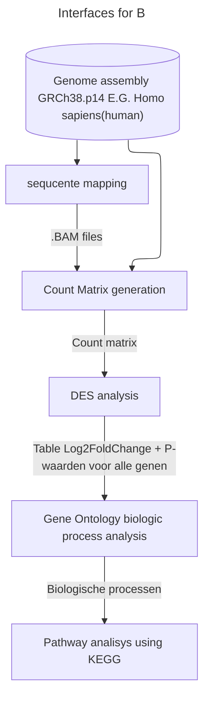
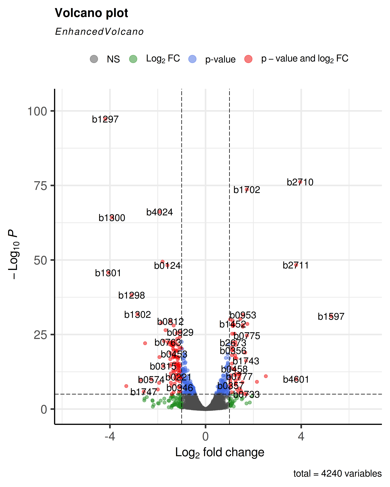
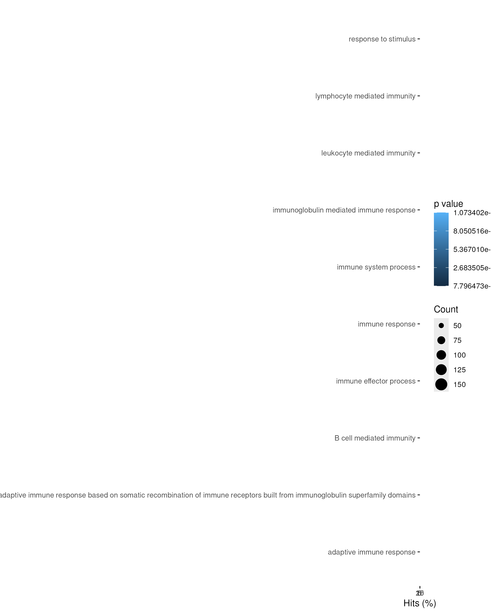
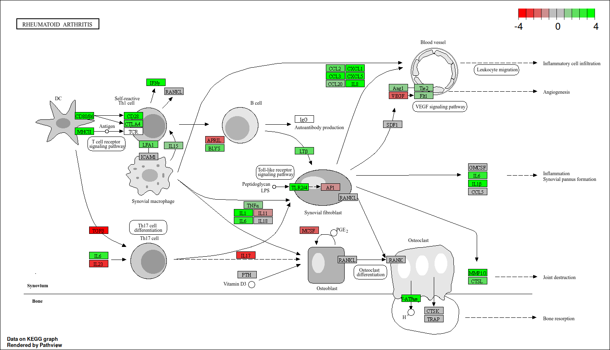
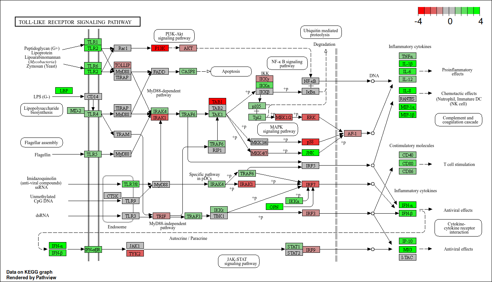

# [Casus Reuma](https://quantum-coder826.github.io/J2P4casusTranscriptomics/)
## Inleiding
Reumatoïde Artritis (RA) is een chronisch auto-immuunziekte ziekte die gewrichtsontsteking & stijve gewrichten veroorzaakt in patiënten.
De ziekte brengt ook een verhoogt risico voor infectie ziekten & osteoporose & de ernst van de klachten wisselt af [[1]](#1).
RA is een onverhelpbare zieke de klachten kunnen verligt wordt met medicatie, 
diagnose wordt uitgevoerd op basis van ziektebeeld en de aanwezigheid van auto-antistoffen[[2]](#2).
Het is momenteel slecht bekend welke factoren een rol spelen in de ontwikkeling van RA,
Paltzer A. [[3]](#3) stelt dat er een erfelijk verband is in het ontwikkelen van RA, hieruit wordt de onderzoeksvraag gesteld:

**Is er een significante verhoging van de genexpressie tussen gezonde individuen en gene met Reumatoïde Artritis?**

## Methoden
Ter het beantwoorden van de onderzoekvraag zijn er 8 patenten benaderd waarvan 4 gezond en 4 met RA.
De aanwezigheid ban RA in de patenten is >12 maanden eerder bepaald met een ACPA-test.
Alle samples zijn verkregen met een synoviumbiopt, zie [Tabel 1](#Tab1) voor een overzicht.

<a id="Tab1">Tabel1:</a>
*Samenstelling samples totaal 8 samples, 4 in Controle bestaand alleen uit vrouwen 
met een gemiddelde leeftijd van 30jaar. 4 in met Reumatoïde artritis (Established)
bestaand alleen uit vrouwen gemiddeld 60jaar oud. Het geheel is gemiddeld 45jaar oud.*

| SampleName | Leeftijd |  Groep  |
|------------|----------|---------|
| SRR4785819 |    31    | Control |
| SRR4785820 |    15    | Control |
| SRR4785828 |    31    | Control |
| SRR4785831 |    42    | Control |
| SRR4785979 |    54    |   RA    |
| SRR4785980 |    66    |   RA    |
| SRR4785986 |    60    |   RA    |
| SRR4785988 |    59    |   RA    |

Het RNA uit de verkregen samples is geisoldeerd & gesequenceerd. Op de verkeregen reads
is een Transcriptomics analyse uitgevoerd. Met deze resultaten is een Gene Ontology(GO) analyse uitegevoerd.
Hiervoor zijn de volgende R-packages gebuikt: BiocManager-1.30.25; Rsubread-2.22.1; Rsamtools-2.24.0; readr-2.1.5; tidyverse-2.0.0; DESeq2-1.48.1; KEGGREST-1.48.0; EnhancedVolcano-1.26.0; pathview-1.48.0; goseq-1.60.0

## Resultaten
### Expression
Om te bepalen of er significante verschillen zijn in het transcriptoom tussen gezonde individuen en gene met Reumatoïde Artritis,
Is eerst het humaan referentie genoom (hg38) gedownload en geindexeerd. Alle samples uit [Tabel1](#Tab1) zijn hiertegen aligend, hieruit zijn `.BAM` files gekomen.
Deze *BAMs* zijn gebruikt om een count matrix te maken waarop vervolgens een DDS analyse op uitgevoerd om de FoldChange van alle geidentificeerde genen te bepalen.
Er zijn een totaal van 2472 genen geidentificeerd me een Padj van < 0.05. Zie [Fig1](#Fig1)] en [Tabel2](#Tab2) voor een Volcano plot en overzicht.

<a id="Fig1">Figuur1:</a>
*Volcanoplot van alle geidentificeerde genen in het humaan genoom gezonde vs patent met RA. Rode punten hebben een padj van lager dan 0.05, Grijze punten hebben een FoldChange onder 1*

<a id="Tab2">Tabel2:</a>
*Eerse 10 geidentificeerde genen met een padj < 0.05 georganiseerd op log2FoldChange hoog naar laag.
Alle Afgebeelde genen zijn betrokken bij de productie van immunoglobine ofwel antilichamen.*

| gene name |  baseMean  | log2FoldChange |   lfcSE   |   stat    |   pvalue     |     padj     |
|-----------|------------|----------------|-----------|-----------|--------------|--------------|
| IGHV3-53  |  358.2872  |    11.42516    |  1.276373 | 8.951274  | 3.514037e-19 | 2.060776e-16 |
| IGKV1-39  |  311.7985  |    11.21278    |  1.410378 | 7.950196  | 1.862163e-15 | 4.171873e-13 |
| IGKV3D-15 |  286.7887  |    11.09350    |  1.382754 | 8.022754  | 1.034005e-15 | 2.514271e-13 |
| IGHV6-1   |  346.5721  |    10.77700    |  1.411903 | 7.632961  | 2.294216e-14 | 4.121114e-12 |
| IGHV1-69  |  180.6577  |    10.44191    |  1.253843 | 8.327928  | 8.226953e-17 | 2.523650e-14 |
| IGHV3-15  |  842.9854  |    10.42893    |  1.828176 | 5.704554  | 1.166483e-08 | 5.149668e-07 |
| IGKV1D-13 |  144.2083  |    10.11700    |  1.212725 | 8.342370  | 7.281642e-17 | 2.268573e-14 |
| IGKV2-28  | 2205.2062  |    10.04342    |  2.028891 | 4.950203  | 7.413624e-07 | 1.759765e-05 |
| IGHV4-31  |  136.0188  |    10.00943    |  1.551437 | 6.451719  | 1.105884e-10 | 8.416118e-09 |
| IGHV1-69-2|  130.5220  |     9.91000    |  2.507762 | 3.951730  | 7.758815e-05 | 8.840172e-04 |

### Gene Ontology (GO)
Op de tabel van FoldChanges is een Gen Ontology (GO) analyse uitgevoerd, dit laat ons verschillen zien in het Biologic process van de cellen waneer een patient RA heeft.
Ook is het een stap in het identificeren in pathways betrokken bij RA. De genen gebuikt voor de GO analysie moesten voldoen aan een `Pajd < 0.01` en een `log2FoldChange > 6`.
De resulterende GO plot is afgebeeld in [Figuur2](Fig2). In de GO analyse valt gelijk op dat de top 10 Biologische processen allemaal immuun systeem gerelateerd zijn, dit is vrij logis gezien dat RA een autoimuun ziekte is.
**Immunoglobulin mediated immune response** en **B cel mediated immunity ...** hebben de hoogste hit% van ongeveer 17%. Gezien de top 10 FoldChanges [Tabel 2](#Tab2) allemaal ImmunoGlobulines zijn is dit ook vrij logisch.

<a id="Fig2">Figuur2:</a>
*Gene Ontology analyse van Biological Process (BP) afgebeeld zijn eerste 10 van alle gevonden BPs*

Op [KEGG](https://www.kegg.jp/) is de disease pathway van RA beschikbaar met id [`hsa05323`](https://www.kegg.jp/entry/hsa05323) met de *pathview* R-lib is deze ingevuld het resultaat is afgebeeld in [figuur 3](#Fig3).
Rood gekleurde genen zijn aan het down-reguleren groene up-reguleren, grijze komen niet voor in de dataset. Het overgroot gedeelte van deze genen zijn voor cytokinen die het immuunsysteem reguleren.
Veel upreguleerden hebben een pro-inflammatory effect op het immuun systeem zoals: TGFa, IL1, IL6(Kan ook anit-inflammatory) & IFNa.[[4,5]](#4)
Zie [figgur 4](#Fig4) voor de Toll-like receptor signaling pathway deze is betrokken bij het inzetten van een inflammatory immuun reactie hier zijn alle cytokinen die een anti-inflammotry immuunrespons generen afgebeeld.
Zoals eerder vernoemd upreguleerden all deze genen.

<a id="Fig3">Figuur3:</a>
*KEGG ziekte pathway diagram hsa05323, de algemene processen betrokken bij RA. Groen gekleurde boxen zijn up-regulerende genen rode down-regulernd.
Het overgroot gedeelte van de up-gereguleerde genen stimuleert een immuunrespons.*

<a id="Fig4">Figuur4:</a>
*KEGG ziekte pathway diagram hsa04620, Toll-like signaling patyway. Deze pathway is betrokken bij het stimuleren van het immuun systeem.
Het produceert voornamelijk cytokines die een inflammatry immuunrespons stimuleert. Deze genen zijn allemaal aan het up reguleren in de pathway (Groen gemarkeerd).*

## Conculsie
Het bepalen of er een signifikante verhoging van genexpressie tussen gezonde individuen en gene met Reumatoïde Artritis?
Is voltooid door het transcriptoom te analyseren van 8 individuen 4 gezond 4 met RA. Hieruit is gekomen dat personen met RA signifikante verhoging hebben in activiteit van het imuun-systeem.
Dit blijkt uit de transciptomische analyse door een signifikante verhoging te zien in de productie van antilichamen en pro-inflammatory cytokinen.
Deze resultaten komen ook overheen met de literatuur.

## Bronnen
<a id="1">[1]</a>
Sparks, J. A. (2019). Rheumatoid Arthritis. Annals of Internal Medicine, 170(1), ITC1–ITC16. https://doi.org/10.7326/AITC201901010

<a id="2">[2]</a>
Majithia, V., & Geraci, S. A. (2007). Rheumatoid Arthritis: Diagnosis and Management. The American Journal of Medicine, 120(11), 936–939. https://doi.org/10.1016/j.amjmed.2007.04.005

<a id="3">[3]</a>
Platzer, A., Nussbaumer, T., Karonitsch, T., Smolen, J. S., & Aletaha, D. (2019). Analysis of gene expression in rheumatoid arthritis and related conditions offers insights into sex-bias, gene biotypes and co-expression patterns. PLOS ONE, 14(7), e0219698. https://doi.org/10.1371/journal.pone.0219698

<a id="4">[4]</a>
Feldmann, M., Brennan, F. M., & Maini, R. N. (1996). Role of cytokines in rheumatoid arthritis. Annual Review of Immunology, 14(Volume 14, 1996), 397–440. https://doi.org/10.1146/ANNUREV.IMMUNOL.14.1.397/CITE/REFWORKS

<a id="5">[5]</a>
Mateen, S., Zafar, A., Moin, S., Qayyum Khan, A., & Zubair, S. (2016). Understanding the role of cytokines in the pathogenesis of rheumatoid arthritis. https://doi.org/10.1016/j.cca.2016.02.010

# Repo indeling
Naast het uitvoeren van deze casus moet ik ook de repo een logische indeling geven hiertoe heb ik dit gedaan.

## Folders
- [`./bams`](./bams) Deze folder bevat alle Binary Aligment Maps zowel de storted als un-sorted variaties, het is er voornamelijk als een back-up.
- [`./dataset`](./dataset) Bevat de *.fasta* files die de paired-end reads vormen van de seq-data, ook een back-up.
- [`./results`](./results) Komen alle gegenereerde resultaten terecht.
  - [`./results/GO`](./results/GO) Ik wilde de *GOsec* resultaten apart bewaren, omdat de Lib 
  - `./results/KEGG` *pathview* Download wat data van KEGG en dumpt dit normaliter in de wd van R, ik wil die bende ergens anders hebben. **Dit is hulpdata en staat dus niet in de repo**
- [`./scripts`](./scripts) Bevat alle scripts die gebuikt zijn voor het genereerden & analyseren van de resultaten. `./scripts/lib.R` is nuttig in de sense dat alle gebuikte R-packages er in staan en kan installeren op de gebruikers machine.
- `./refSeqHomoSapiens` Hierin staat het geïndexeerd humaan referentie genoom. **GitHub laat geen files toe over 100MB en ik wil geen folder van 23gB uploaden.**

