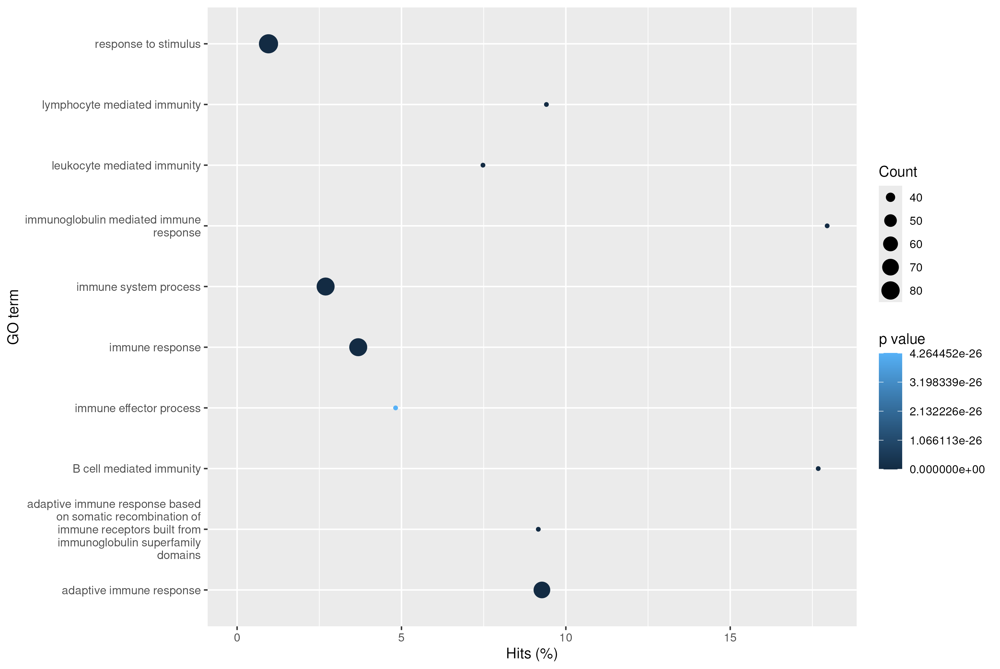

# [Casus Reuma](https://quantum-coder826.github.io/J2P4casusTranscriptomics/)

## Inleiding
Reumatoïde Artritis (RA) is een chronische auto-immuunziekte die voorkomt bij 5 op de 1000 mensen,
voornamelijk bij oudere vrouwen. Het leidt tot langdurige ontstekingen, pijn en stijve gewrichten.
Wanneer onbehandeld, kan de ziekte leiden tot permanente schade aan de gewrichten,
vorming van noduli en reumatoïde vasculitis, wat kan leiden tot afsterving van bloedvaten[[1]](#1). 
Diagnose gebeurt aan de hand van het ziektebeeld en de aanwezigheid van auto-antistoffen.
Wanneer RA vroeg wordt gediagnosticeerd, kunnen klachten met medicatie worden gemanaged[[2]](#2). 
De algemene consensus is dat RA wordt veroorzaakt door een combinatie van genetische aanleg en omgevingsfactoren[[6]](#6)
Veel onderzoeken naar het genetisch aspect trachten specifieke genen en mutaties te koppelen aan RA.
Toch is het belangrijk een algemeen beeld te krijgen van het transcriptoom van patiënten met RA [3].
Daaruit volgt de volgende onderzoeksvraag:

Is er een significante verhoging van de genexpressie in het transcriptoom van patiënten met Reumatoïde Artritis vergeleken met gezonde personen?

De volgende deelvragen worden beantwoord:

* Welke genen zijn het sterkst up-gereguleerd bij personen met RA in vergelijking met gezonde personen?
* Tot welke biologische processen behoren deze genen?
* Met welke pathways zijn deze biologische processen geassocieerd?

## Methoden

Ter het beantwoorden van de onderzoekvraag zijn er 8 patenten benaderd waarvan 4 gezond en 4 met RA.
De aanwezigheid ban RA in de patenten is \>12 maanden eerder bepaald met een ACPA-test. 
Alle samples zijn verkregen met een synoviumbiopt, zie [Tabel 1](#Tab1) Voor een overzicht.
Het RNA uit de monsters is geïsoleerd en gesequenced.

<a id="Tab1">Tabel1:</a> *Overzicht van de acht monsters. 
De controlegroep bestaat uit vier vrouwen met een gemiddelde leeftijd van 30 jaar. 
De RA-groep bestaat uit vier vrouwen met een gemiddelde leeftijd van 60 jaar. 
De gemiddelde leeftijd van alle deelnemers is 45 jaar.*

| SampleName | Leeftijd | Groep   |
|------------|----------|---------|
| SRR4785819 | 31       | Control |
| SRR4785820 | 15       | Control |
| SRR4785828 | 31       | Control |
| SRR4785831 | 42       | Control |
| SRR4785979 | 54       | RA      |
| SRR4785980 | 66       | RA      |
| SRR4785986 | 60       | RA      |
| SRR4785988 | 59       | RA      |

Om genen met significante veranderingen in expressie (fold change) te identificeren, 
zijn alle verkregen reads met `Rsubread-2.22.1` en `Rsamtools-2.24.0` uitgelijnd op het humane referentiegenoom [GRCh38.p14](https://www.ncbi.nlm.nih.gov/datasets/genome/GCF_000001405.40/).
Deze data is gebruikt om een count matrix te genereren. 
Vervolgens is met `DESeq2-1.48.1` de genexpressie berekend.
Om biologische processen te koppelen aan de genexpressie is met `goseq-1.60.0` en `GO.db-3.21.0` een Gene Ontology (GO)-analyse uitgevoerd.
De resultaten hiervan zijn gebruikt om relevante pathways te identificeren op [KEGG.jp](https://www.kegg.jp/) 
en te visualiseren met `pathview-1.48.0` en `KEGGREST-1.48.0`.
Zie [Figuur 5](#Fig5) oor een flowchart van het proces. 
Aanvullend gebruikte packages zijn: `BiocManager-1.30.25`, `readr-2.1.5`, `tidyverse-2.0.0` en `EnhancedVolcano-1.26.0`.

<a id="Fig5">Figuur 5:</a>
*Flowchart dataanalyse, alle vierkanten zijn scripts alle cylinder data en parallelogramen resultaten. Alle script bevatten core gebuikte packages en linken naar hun corresponderende bron/script.*

## Resultaten

### Expression

Uit de transcriptomische analyse zijn 2085 genen geïdentificeerd
met een significante verhoging in expressie (Padj < 0.05).
Zie [Fig1](#Fig1) voor de volcanoplot van alle geïdentificeerde genen.
[Tabel2](#Tab2) toont de 10 genen met de hoogste log2FoldChange.

 
<a id="Fig1">Figuur1:</a> 
*Volcanoplot van alle geïdentificeerde genen: gezonde personen versus RA-patiënten.
Rode punten: Padj < 0.05. Grijze punten: FoldChange < 1.*

<a id="Tab2">Tabel2:</a> 
*Top 10 genen (Padj < 0.05), gesorteerd op log2FoldChange. 
De meeste genen zijn betrokken bij de productie van immunoglobulinen (antilichamen).*

| gene name | baseMean | log2FoldChange | lfcSE | stat | pvalue | padj |
|-----------|-----------|-----------|-----------|-----------|-----------|-----------|
| IGHV3-53 | 358.2872 | 11.42516 | 1.276373 | 8.951274 | 3.514037e-19 | 2.060776e-16 |
| IGKV1-39 | 311.7985 | 11.21278 | 1.410378 | 7.950196 | 1.862163e-15 | 4.171873e-13 |
| IGKV3D-15 | 286.7887 | 11.09350 | 1.382754 | 8.022754 | 1.034005e-15 | 2.514271e-13 |
| IGHV6-1 | 346.5721 | 10.77700 | 1.411903 | 7.632961 | 2.294216e-14 | 4.121114e-12 |
| IGHV1-69 | 180.6577 | 10.44191 | 1.253843 | 8.327928 | 8.226953e-17 | 2.523650e-14 |
| IGHV3-15 | 842.9854 | 10.42893 | 1.828176 | 5.704554 | 1.166483e-08 | 5.149668e-07 |
| IGKV1D-13 | 144.2083 | 10.11700 | 1.212725 | 8.342370 | 7.281642e-17 | 2.268573e-14 |
| IGKV2-28 | 2205.2062 | 10.04342 | 2.028891 | 4.950203 | 7.413624e-07 | 1.759765e-05 |
| IGHV4-31 | 136.0188 | 10.00943 | 1.551437 | 6.451719 | 1.105884e-10 | 8.416118e-09 |
| IGHV1-69-2 | 130.5220 | 9.91000 | 2.507762 | 3.951730 | 7.758815e-05 | 8.840172e-04 |

### Gene Ontology (GO)

Voor de GO-analyse zijn 131 genen geselecteerd met een Padj < 0.01 en een log2FoldChange > 6.
Deze analyse identificeerde 52 biologische processen (GO:BP termen) met een P-waarde < 0.01.
De top 10 processen staan in [Figuur2](Fig2).
Opvallend is dat 9 van de 10 processen immuungerelateerd zijn.
De termen **Immunoglobulin mediated immune response** [[GO:0016064]](https://amigo.geneontology.org/amigo/term/GO:0016064) en 
**en B cell mediated immunity** [[GO:0019724]](https://amigo.geneontology.org/amigo/term/GO:0019724) 
hebben het hoogste hitpercentage (~17%). Beide van deze GO termen hebben te maken met een immuun reactie op basis van immunogobine & cytokines.

 
<a id="Fig2">Figuur2:</a> *
Gene Ontology analyse van Biological Process (BP) afgebeeld zijn eerste 10 van alle gevonden BPs*

### KEGG

Op basis van de GO-resultaten zijn de pathways [hsa05323](https://www.kegg.jp/entry/hsa05323) & [hsa04620](https://www.kegg.jp/entry/hsa04620) geïdentificeerd.

* [Hsa05323](https://www.kegg.jp/entry/hsa05323) beschrijft in het algemeen RA-processen [(Figuur3)](#Fig3).
* [Hsa04620](https://www.kegg.jp/entry/hsa04620) betreft de Toll-like receptor signaling pathway [(Figuur4)](#Fig4), betrokken bij het initiëren van inflammatoire immuunreacties. 

Veel van de verhoogd tot expressie gebrachte genen hebben een inflammatoire werking,
zoals TGFa, IL1, IL6 (kan ook anti-inflammatoir zijn) & IFNa[[4,5]](#4). 

 <a id="Fig3">Figuur3:</a> *KEGG ziekte pathway diagram hsa05323, de algemene processen betrokken bij RA. Groen gekleurde boxen zijn up-regulerende genen rode down-regulernd. Het overgroot gedeelte van de up-gereguleerde genen stimuleert een immuunrespons.*

 <a id="Fig4">Figuur4:</a> *KEGG ziekte pathway diagram hsa04620, Toll-like signaling patyway. Deze pathway is betrokken bij het stimuleren van het immuun systeem. Het produceert voornamelijk cytokines die een inflammatry immuunrespons stimuleert. Deze genen zijn allemaal aan het up reguleren in de pathway (Groen gemarkeerd).*

## Conculsie

De vraag of er een significante verhoging is van genexpressie bij personen met Reumatoïde Artritis is beantwoord
door het transcriptoom van 8 personen (4 gezond, 4 met RA) te analyseren.

Personen met RA vertonen een verhoogde activiteit van het immuunsysteem [(Figuur 2)](#Fig2),
blijkend uit verhoogde expressie van genen die betrokken zijn bij de productie van antilichamen
en pro-inflammatoire cytokinen [(Figuren 3-4)](#Fig3). Deze resultaten komen overeen met de literatuur[[4,5]](#4).

## Bronnen

<a id="1">[1]</a> Aletaha, D., & Smolen, J. S. (2018). Diagnosis and Management of Rheumatoid Arthritis. JAMA, 320(13), 1360. <https://doi.org/10.1001/jama.2018.13103>

<a id="2">[2]</a> Majithia, V., & Geraci, S. A. (2007). Rheumatoid Arthritis: Diagnosis and Management. The American Journal of Medicine, 120(11), 936–939. <https://doi.org/10.1016/j.amjmed.2007.04.005>

<a id="3">[3]</a> Platzer, A., Nussbaumer, T., Karonitsch, T., Smolen, J. S., & Aletaha, D. (2019). Analysis of gene expression in rheumatoid arthritis and related conditions offers insights into sex-bias, gene biotypes and co-expression patterns. PLOS ONE, 14(7), e0219698. <https://doi.org/10.1371/journal.pone.0219698>

<a id="4">[4]</a> Feldmann, M., Brennan, F. M., & Maini, R. N. (1996). Role of cytokines in rheumatoid arthritis. Annual Review of Immunology, 14(Volume 14, 1996), 397–440. <https://doi.org/10.1146/ANNUREV.IMMUNOL.14.1.397/CITE/REFWORKS>

<a id="5">[5]</a> Mateen, S., Zafar, A., Moin, S., Qayyum Khan, A., & Zubair, S. (2016). Understanding the role of cytokines in the pathogenesis of rheumatoid arthritis. <https://doi.org/10.1016/j.cca.2016.02.010>

<a id="6">[6]</a> Oliver, J. E., & Silman, A. J. (2006). Risk factors for the development of rheumatoid arthritis. Scandinavian Journal of Rheumatology, 35(3), 169–174. <https://doi.org/10.1080/03009740600718080>

# Repo-indeling

Naast het uitvoeren van deze casus moet ik ook de repository een logische indeling geven. Hieronder volgt de structuur die ik heb aangehouden.

## Mappen

-   [`./bams`](./bams) Deze map bevat alle Binary Alignment Maps, zowel de gesorteerde als de niet-gesorteerde varianten. Ze dienen voornamelijk als back-up.
-   [`./dataset`](./dataset) Bevat de *.fasta*-bestanden die de paired-end reads van de sequencingdata vormen. Ook dit is bedoeld als back-up.
-   [`./results`](./results) Hier worden alle gegenereerde resultaten opgeslagen.
    -   [`./results/GO`](./results/GO) Bevat de *GOseq*-resultaten, die ik apart wil bewaren.
    -   `./results/KEGG` *pathview* downloadt gegevens van KEGG en dumpt deze normaal gesproken in de working directory van R. Ik wil die rommel liever ergens anders opslaan. **Let op: dit is hulpdata en staat dus niet in de repo.**
-   [`./scripts`](./scripts) Bevat alle scripts die zijn gebruikt voor het genereren en analyseren van de resultaten. Het script `./scripts/lib.R` is handig omdat hierin alle gebruikte R-packages zijn opgenomen en automatisch geïnstalleerd kunnen worden op de machine van de gebruiker.
-   [`./refSeqHomoSapiens`](./refSeqHomoSapiens) Bevat het geïndexeerde humane referentiegenoom. **Let op: GitHub staat geen bestanden toe groter dan 100 MB. Deze map bevat ±23 GB aan data en is daarom niet geüpload.**
