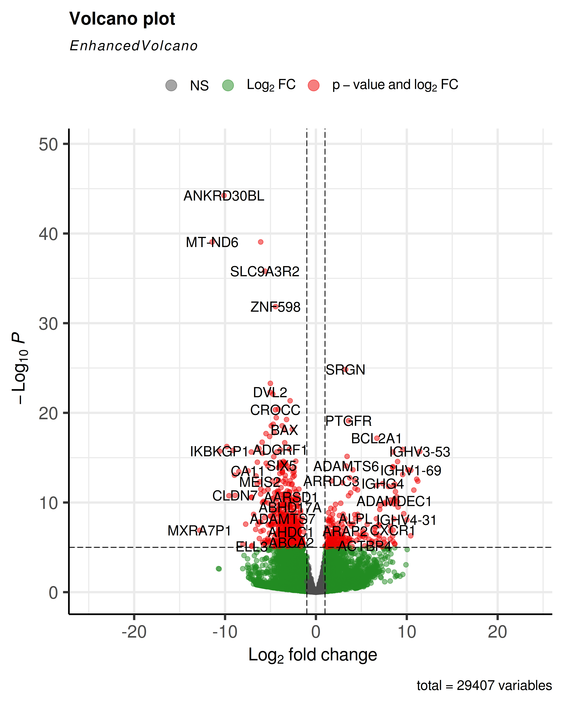

# Casus Reuma

## Inleiding
Reumatoïde Artritis (RA) is een chronisch auto-immuunziekte ziekte die gewrichtsontsteking & stijve gewrichten veroorzaakt in patiënten.
De ziekte brengt ook een verhoogt risico voor infectie ziekten & osteoporose & de ernst van de klachten wisselt af [[1]](#1).
RA is een onverhelpbare zieke de klachten kunnen verligt wordt met medicatie, 
diagnose wordt uitgevoerd op basis van ziektebeeld en de aanwezigheid van auto-antistoffen[[2]](#2).
Het is momenteel slecht bekend welke factoren een rol spelen in de ontwikkeling van RA,
Paltzer A. [[3]](#3) stelt dat er een erfelijk verband is in het ontwikkelen van RA, hieruit wordt de onderzoeksvraag gesteld:

**Is er een significant verschil in het transcriptoom tussen gezonde individuen en gene met Reumatoïde Artritis?**

## Methoden
Ter het beantwoorden van de onderzoekvraag zijn er 8 patenten benaderd waarvan 4 gezond en 4 met RA.
De aanwezigheid ban RA in de patenten is >12 maanden eerder bepaald met een ACPA-test.
Alle samples zijn verkregen met een synoviumbiopt, zie [Tabel 1](#Tab1) voor een overzicht.

| SampleName | Leeftijd |  Groep  |
|------------|----------|---------|
| SRR4785819 |    31    | Control |
| SRR4785820 |    15    | Control |
| SRR4785828 |    31    | Control |
| SRR4785831 |    42    | Control |
| SRR4785979 |    54    |   RA    |
| SRR4785980 |    66    |   RA    |
| SRR4785986 |    60    |   RA    |
| SRR4785988 |    59    |   RA    |

<a id="Tab1">Tabel1:</a>
*Samenstelling samples totaal 8 samples, 4 in Controle bestaand alleen uit vrouwen 
met een gemiddelde leeftijd van 30jaar. 4 in met Reumatoïde artritis (Established)
bestaand alleen uit vrouwen gemiddeld 60jaar oud. Het geheel is gemiddeld 45jaar oud.*

Het RNA uit de verkregen samples is geisoldeerd & gesequenceerd. Op de verkeregen reads
is een Transcriptomics analyse uitgevoerd.

## Resultaten

<a id="Fig1">Figuur1:</a>
*test*

## Conculsie

## Bronnen
<a id="1">[1]</a>
Sparks, J. A. (2019). Rheumatoid Arthritis. Annals of Internal Medicine, 170(1), ITC1–ITC16. https://doi.org/10.7326/AITC201901010

<a id="2">[2]</a>
Majithia, V., & Geraci, S. A. (2007). Rheumatoid Arthritis: Diagnosis and Management. The American Journal of Medicine, 120(11), 936–939. https://doi.org/10.1016/j.amjmed.2007.04.005

<a id="3">[3]</a>
Platzer, A., Nussbaumer, T., Karonitsch, T., Smolen, J. S., & Aletaha, D. (2019). Analysis of gene expression in rheumatoid arthritis and related conditions offers insights into sex-bias, gene biotypes and co-expression patterns. PLOS ONE, 14(7), e0219698. https://doi.org/10.1371/journal.pone.0219698